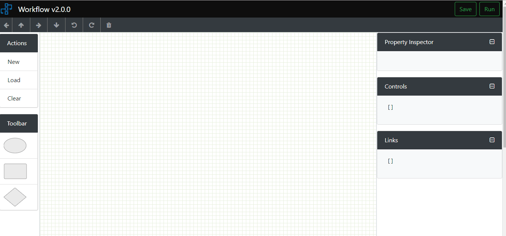

# Workflow-UI v2.0.0

##### Workflow-UI is a diagramatic web ui tool to create workflows in a visualize way using different controls and convert into a generic `json` format. It allows controls to be drag and drop with editable facility and also customizable output json.



## Table of contents

* [Why Workflow-UI v2.0.0](#why-workflow-ui-v2.0.0)
* [Usage](#usage)
* [Technologies used](#technologies-used)
* [Backend APIs](#backend-apis)
* [How to Build, Run & Deploy](#build-run-deploy)
* [Future release](#future-release)

## Why Workflow-UI v2.0.0

* Drag/Drop facility for drawing workflows
* Debugger window (Displaying instant `json` data and `co-ordinate` details for control/connectors)
* Simple for use and great visualization
* Customizabe json data object format

##### New features added in version 2.0.0
* Drag connection from each direction of control and connect to any direction
* Movement of arrows
* key binding for movement
* On screen mouse click movement
* Toggle Yes/No direction in condition control
* Toggle expand/collapse for propery/control/link bars 

## Technologies Used

* [Angular CLI](https://github.com/angular/angular-cli) version 6.1.1.
* SVG (for drawing different shapes control)
* bootstrap version 4.1.3
* ngx-bootstrap version 3.0.1
* font-awesome version 4.7.0

## Backend APIs

Following API endpoints are configued in ui to fetch and post data from backend.

Find all the api endpoints in api-client file from below path 
```
workflow-ui/src/app/apiclient/api-client.service.ts
```

Response format of each end points 

```
 GET: http://apidomain/workflows/getsteptypes
 200 OK,
 // response data
 [{ 
    stepType: 'WorkflowCore.Service.Demo.HelloWorldService',
    stepName: 'HelloWorldService',
    assembly: 'WorkflowCore'},
    { stepType: 'WorkflowCore.Service.Demo.AddNumbers',
    stepName: 'AddNumbers',
    assembly: 'WorkflowCore'},
    { stepType: 'WorkflowCore.Service.Demo.PrintMessageService',
    stepName: 'PrintMessageService',
    assembly: 'WorkflowCore'
 }]

```

```
GET: http://apidomain/workflows/DataContextAttributes
200 OK,
// response data
 {
     Input: ['Value1', 'Value2', 'Value3', 'message'],
     Output: ['Value1', 'Value2', 'Value3', 'Result']
 }
```

```
GET: http://apidomain/workflows/GetAllWorkflows
200 OK,
// response data
[
  {
    "id": 1,
    "name": "untitled_template_1",
    "jsonObject": "{\"controls\":[{\"id\":1,\"type\":\"circle\",\"cordinate\":{\"x\":\"386\",\"y\":\"61\"},\"nextId\":[2],\"data\":{\"Id\":\"Start\",\"StepType\":\"Start\",\"NextStepId\":\"\"},\"isSelected\":false,\"isMultiConnect\":false,\"conditionYesId\":[],\"isIntial\":false},{\"id\":2,\"type\":\"activity\",\"cordinate\":{\"x\":\"269\",\"y\":\"191\"},\"nextId\":[3],\"data\":{\"Id\":\"Activity1\",\"StepType\":\"WorkflowCore.Service.Demo.PrintMessageService, WorkflowCore\",\"NextStepId\":\"\"},\"isSelected\":false,\"isMultiConnect\":false,\"conditionYesId\":[]},{\"id\":3,\"type\":\"circle\",\"cordinate\":{\"x\":398,\"y\":\"401\"},\"nextId\":[],\"data\":{\"Id\":\"End\",\"StepType\":\"Start\",\"NextStepId\":\"\"},\"isSelected\":false,\"isMultiConnect\":false,\"conditionYesId\":[],\"isIntial\":false}],\"links\":[{\"id\":1,\"fromId\":\"1\",\"toId\":2,\"cordinate\":{\"x1\":\"386\",\"y1\":81,\"x2\":344,\"y2\":\"191\"},\"fromDirection\":\"down\",\"direction\":\"down\",\"isSelected\":false},{\"id\":2,\"fromId\":\"2\",\"toId\":3,\"cordinate\":{\"x1\":344,\"y1\":241,\"x2\":398,\"y2\":381},\"fromDirection\":\"down\",\"direction\":\"down\",\"isSelected\":false}],\"parsedData\":{\"Id\":\"untitled_template_1\",\"DataType\":\"WorkflowCore.Models.DataContext, WorkflowCore\",\"Version\":\"1\",\"Steps\":[{\"Id\":\"Activity1\",\"StepType\":\"WorkflowCore.Service.Demo.PrintMessageService, WorkflowCore\",\"NextStepId\":\"\"}]}}",
    "status": "active",
    "addedOn": "Mon Sep 24 2018 12:08:05 GMT+0530 (India Standard Time)",
    "_id": "b49714d9aa46481db7d86d47e3b9831e"
  }
]  
```
## Build Run Deploy

* Run `npm install` to install all the dependencies used in this app (availabe in `package.json` file)
* Run `ng build` to build the project. 
* The build artifacts will be stored in the `dist/` directory. Use the `--prod` flag for a production build.
* Run `ng serve` to run in local server. (it will run in `http://localhost:4200` the default port of angular-cli server, to run in different port use `ng serve --port=<YOURPORT>`)
* For deployment run `ng build` and deploy the `dist/` directory contents to any http server.

## Future Release


* Resizing the controls
* New controls in toolbar
* Real-time status notification of each workflow steps while executing from backend (using message queue)
* Undo/Redo feature
* Export/Import workflow json from local drive


